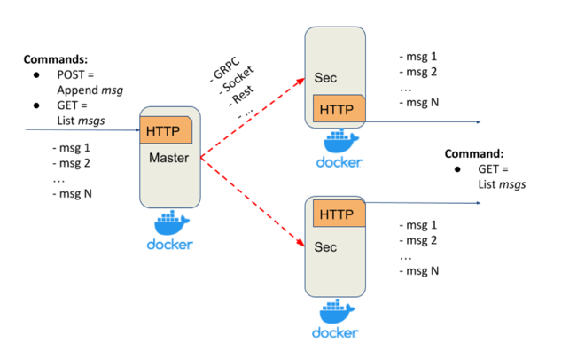

# de-uku-distributed-systems

The Replicated Log is designed to have a deployment architecture consisting of one Master server
and any number of Secondary servers.
This iteration focuses on implementing a simple REST-based API for message replication.

## Makefile

Create requirements.txt

```sh
make requirements
```

## Run app

```sh
make image
docker-compose up -d --build
```

## Architecture



### Master Server

The Master server exposes a simple HTTP server on port 8000 with the following API:

- `GET /messages`: Retrieves all messages from the in-memory list.

- `POST /messages`: Appends a message to the in-memory list and initiates replication to all Secondaries. The POST
  request will block until an ACK (acknowledgment) is received from all Secondaries, ensuring blocking replication.

  Request Body:
    ```json
    {
      "name": "<message_content>"
    }
    ```

### Secondary Server

The Secondary servers expose simple HTTP servers on the following ports:

- Secondary Server 01: Port 8001
- Secondary Server 02: Port 8002

The Secondary server exposes a simple HTTP server with the following API:

- `GET /replicated_messages`: Retrieves all replicated messages from the in-memory list.
